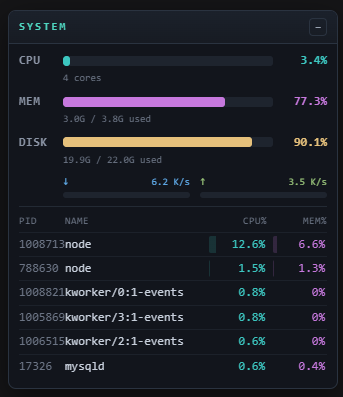

# dsh-top

A plugin for the [DeepSeek Harness](https://github.com/deepseek-ai/deepseek-harness) (DSH) **web GUI**: a system monitoring tool that shows live system stats in a floating, collapsible panel pinned to the **top-right corner**.

<p align="center">
  
</p>

[](https://www.dsh.so/artifact/dsh-top/)

## Features

- **CPU** — live utilisation (computed from `os.cpus()` tick deltas) + core count
- **MEM** — used / total with percentage bar (from `os.totalmem()` / `os.freemem()`)
- **SWAP** — used / total with percentage bar (Linux only, from `/proc/meminfo`)
- **LOAD + UPTIME** — 1 / 5 / 15-minute load average and host uptime (from Node `os`, every platform)
- **DISK** — used / total with percentage bar (platform-specific)
- **NETWORK** — download / upload throughput (platform-specific byte deltas)
- **Top 6 processes** — PID, name, CPU%, MEM% (platform-specific)
- Dark color-coded palette (cyan CPU, magenta RAM, yellow disk, blue/green network), monospace
- **Draggable** via the title bar, **collapsible** via the `–` / `+` button
- Transient monitor processes (`ps`, `awk`, `head`, …) are filtered out of the top-processes list

## How it works

| Part | File | What it does |
|---|---|---|
| Host half | `lib/index.js` | Registers `GET /api/dsh-top-stats`; CPU + memory + load-avg + uptime use Node `os` APIs with container-aware cgroup overrides; disk, network, swap and processes use per-platform collectors that degrade to `null` when unavailable. Every external command is killed after a 5 s `timeout`. |
| Browser half | `lib/client.js` | `dsh.client` web bundle; registers the panel into the frame-wide `shell.overlay` slot; polls every 2 s (pauses while collapsed). |
| Composition | `cordis.patch.yml` | The `dsh.bundle` patch layer that inserts the loader entry. |

## Platform support

DSH host code runs on Linux, but the DSH *server* can be run on any OS Node.js supports. `dsh-top` is multi-platform: it always reports CPU, memory, load average and uptime (Node `os`, no subprocess), and fills in disk / network / swap / processes where the platform allows. Missing sections are shown as **n/a** in the widget rather than failing the whole request.

| Platform | CPU | MEM | SWAP | DISK | NETWORK | PROCESSES |
|---|---|:---:|:---:|:---:|:---:|:---:|
| Linux | ✅ | ✅ | `/proc/meminfo` | `df` | `/proc/net/dev` | `ps` |
| macOS | ✅ | ✅ | n/a | `df` | `netstat -ib` | `ps` (BSD) |
| Windows | ✅ | ✅ | n/a | PowerShell `Get-PSDrive` | PowerShell `Get-NetAdapterStatistics` | PowerShell `Get-Process`† |
| Containers (cgroup) | ✅* | ✅* | `/proc/meminfo`* | `df`* | `/proc/net/dev`* | `ps`* |
| Other / unknown | ✅ | ✅ | n/a | n/a | n/a | n/a |

Load average (1 / 5 / 15 min) and uptime are present on every platform.

† Windows process CPU is a **lifetime-average percentage** — `Get-Process.CPU` (cumulative CPU seconds) divided by process age, the same semantics Linux `ps pcpu` reports — and MEM% is derived from the real RSS bytes, not the raw working-set value. Every external collector (`ps`, `df`, `powershell`, …) runs with a **5 s timeout**, so a wedged tool degrades its section to n/a instead of hanging the request.

\* Container support is **container-aware and graceful**:

- **Memory** — when a cgroup memory limit is set (Docker `--memory`, a Kubernetes limit, systemd unit limit), the MEM meter reports the container's *limit* and current usage (cgroup v2 `memory.max`/`memory.current`, or v1 `memory.limit_in_bytes`/`usage_in_bytes`) instead of the host's total. On an unlimited cgroup it falls back to the host `os.totalmem()` view.
- **CPU cores** — when the cgroup restricts CPU (v2 `cpu.max` quota/period, or v1 `cpu.cfs_quota_us/period_us`), the core count reflects the quota; otherwise it uses `os.cpus().length`.
- **Tightest ancestor wins, sentinels are safe** — the limit files are read by walking *our own* cgroup path upward (not just the cgroup root), so a Docker limit under a host-level cap is reported correctly. Kernel-default sentinels are treated as "no limit": v2 `max`, v1 CFS `-1`, and the ~2^63 bytes v1 `memory.limit_in_bytes` reports on an unrestricted root — so an unrestricted host is never misread as having exabyte-sized RAM.
- **Slim/distroless images** that lack `df`/`ps` still report CPU + memory + load + uptime; the missing DISK/NETWORK/SWAP/PROCESSES sections render as **n/a**.

The CPU, memory, load average and uptime meters work on every Node platform. Disk, network, swap and process meters depend on the listed command/pseudo-file being present — otherwise those sections render as **n/a** while the rest keep working.

## Testing

```sh
npm test
```

Runs a zero-dependency suite (`node --test`) over the pure collector parsers with realistic fixtures: Linux (`df`, `/proc/net/dev`, `ps`, `/proc/meminfo` swap), macOS (`netstat -ib`, BSD `ps`), and Windows (PowerShell JSON output — including the CPU-seconds→percentage and RSS-bytes→percent conversions), plus the cgroup file parsers (`memory.max`, `cpu.max`, CFS quota, and the "no limit" sentinels), the `parseMeminfo` swap/absence handling, the live container memory/CPU fallback contract, and the exec-timeout guard. The macOS/Windows parsers are verified here without needing a live Mac or Windows machine — only the thin command-execution wrapper around them is platform-bound.

## Security

Because it is a *system monitor*, the host half reads host-wide CPU, memory, disk, network and process state. The cross-platform core (CPU + memory) uses Node's built-in `os` module — no subprocess and no OS-specific pseudo-files. Linux `/proc` reads go through Node's own `fs.readFileSync`. Only the platform collectors that need system tools invoke them — `ps`, `df`, and on Windows `powershell` — every time via `execFileSync` with a **static argv array** (never a shell string, no shell `-Command` interpolation of untrusted data), so there is **no shell-injection surface** and no attacker-controlled input. On Windows the PowerShell sub-command is a fixed script literal; none of its values come from the HTTP request. No data leaves the host, no credentials are read, and every read is **read-only**.

> `dsh.so`'s static scanner flags `node:child_process` as "critical". That is a heuristic signal on the mere presence of process access — not a vulnerability. Process access is intrinsic to a monitoring tool; review the (small) source yourself: the collectors are platform-whitelisted, argument-confined, and read-only, and any failure degrades to "n/a" rather than failing the request.

## Install

```sh
dsh plugin --profile web add dsh-top
```

Then restart the web app and refresh the page — the panel appears at the top-right.

## License

[MIT](LICENSE)
